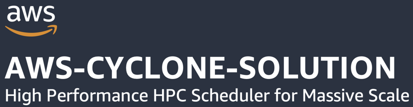

# Table of Contents

- [Table of Contents](#table-of-contents)
- [What is AWS-Cyclone-Solution?](#what-is-aws-cyclone-solution)
  - [Capabilities \& Performance](#capabilities--performance)
  - [Benefits](#benefits)
- [There are Two Deployment Options](#there-are-two-deployment-options)
  - [Install and use the HYPER CLI to deploy hosts, configure resources \& manage jobs](#install-and-use-the-hyper-cli-to-deploy-hosts-configure-resources--manage-jobs)
  - [Deploy and configure resources with AWS CDK](#deploy-and-configure-resources-with-aws-cdk)
- [HYPER CLI:](#hyper-cli)
  - [Job Commands](#job-commands)
    - [Example Job Submit File](#example-job-submit-file)
  - [Resource Commands](#resource-commands)
    - [Host Commands](#host-commands)
    - [Region Commands](#region-commands)
    - [Cluster Commands](#cluster-commands)
    - [Queue Commands](#queue-commands)
    - [Images Commands](#images-commands)
    - [Job Definition Commands](#job-definition-commands)
  - [Installing CLI](#installing-cli)
  - [GETTING STARTED USING CLI:](#getting-started-using-cli)
    - [SUGGESTIONS:](#suggestions)
- [Deploy with AWS CDK](#deploy-with-aws-cdk)
  - [Preparations](#preparations)
  - [Configuring your resources](#configuring-your-resources)
  - [Import Deployment Into HYPER CLI](#import-deployment-into-hyper-cli)
- [Architecture](#architecture)
- [EARLY RESULTS](#early-results)
# What is AWS-Cyclone-Solution?
AWS-Cyclone-Solution is a cloud-native HPC job scheduler and resource orchestrator built for AWS customers that require large compute capacity and high scheduling throughput.
Customers can deploy compute clusters that span across all AWS regions and their on-premise compute from a single control plane. They can submit jobs at high throughput  to increase resource utilization and enable massive scale, even for short running jobs.

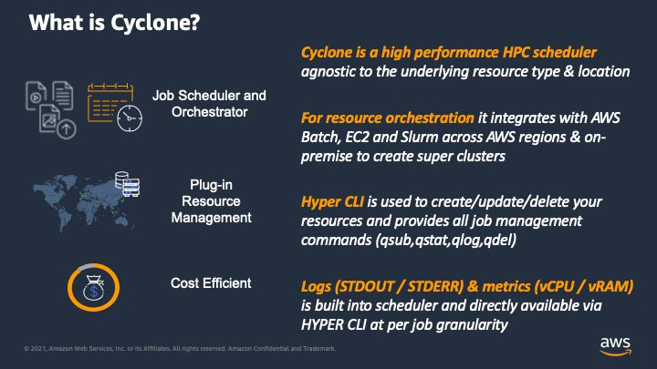

## Capabilities & Performance 
   * Deploy compute clusters that span all AWS regions and configure region weights for your queues
   * Use automatic region weight setting so jobs are automatically routed to regions with capacity or lower cost
   * Leverage on-premise compute capacity with hybrid clusters
   * Schedule jobs at up to 12 000 transactions per second with default account limits and get up to 100 000 TPS by raising limits
   * API is built to mimic both AWS Batch & IBM LSF proving a familiar user interface for users of both
   * Solution provides a service like experience for resource creation and configuration via CLI
   * Run containers on AWS Batch or instances on EC2

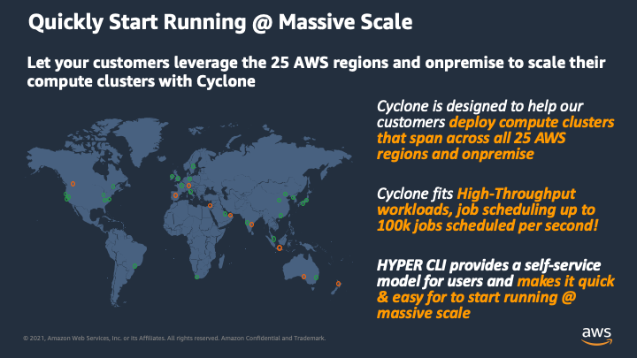
## Benefits
  * Optimize spot instance cost and availability by diversifying across all spot pools globally
  * AWS-Cyclone-Solution can automatically prioritize regions with lower spot cost and will leverage the available capacity across all regions without needing to retry jobs
  * Global scale allows you to use the instance types that work best for your jobs and still get the scale you need

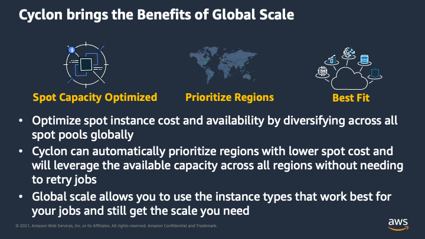
# There are Two Deployment Options
## Install and use the HYPER CLI to deploy hosts, configure resources & manage jobs
For normal users that are not planning on making changes to the stack or who wish to use a deployment pipeline to for their environments. The HYPER CLI provides a simple and user friendly interface to use AWS-Cyclone-Solution.

See section below "HYPER CLI" to continue with this approach.

## Deploy and configure resources with AWS CDK
This is for anyone code savy that wants to potentially make code changes or for those that want to integrate into a new or existing CICD pipeline. Here you can use the configuration files in the repo to specify your region and resouce configurations and then deploy the multi-region environement with "cdk deploy" commands. You can still import this deployment into the HYPER CLI to make use of the job management commands to use and interact with your deployment.

See section below "Deploy with AWS CDK" to continue with this approach.
# HYPER CLI:

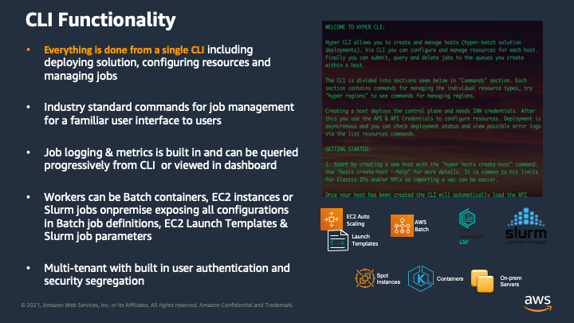

  Hyper CLI allows you to create and manage hosts (AWS-Cyclone-Solution solution
  deployments). Via CLI you can configure and manage resources for each host.
  Finally you can submit, query and delete jobs to the queues you create
  within a host.

  The CLI is divided into sections seen below in "Commands" section. Each
  section contains commands for managing the individual resource types, try
  "hyper regions" to see commands for managing regions.

  Creating a host deploys the control plane and needs IAM credentials. After
  this you use the API & API Credentials to configure resources. Deployment
  is asyncronous and you can check deployment status and view possible error
  logs via the list resources commands.

## Job Commands

qsub [OPTIONS] FILENAME\
qstat [OPTIONS]\
qlog [OPTIONS]\
qdel [OPTIONS]\

### Example Job Submit File
```
#!/bin/bash
## BEGIN HYPER SETTINGS: Note HYPER lines MUST start with #
#HYPER -n job-name
#HYPER -q queue-name
#HYPER -r 2
#HYPER -d job-definition-name
## END HYPER SETTINGS
## BEGIN ACTUAL CODE
for i in $(seq 60)
do
    echo $i seconds
    sleep 1
done
## END ACTUAL CODE
```

## Resource Commands
All resource commands start with 'hyper'. For example "hyper hosts...', 'hyper clusters..."
### Host Commands
hyper hosts create-host [OPTIONS]\
hyper hosts list-hosts [OPTIONS]\
hyper hosts select-host [OPTIONS] HOST_NAME\
hyper hosts update-host [OPTIONS]\
hyper hosts import-deployment [OPTIONS]\

### Region Commands
hyper regions init-main-region [OPTIONS]\
hyper regions add-region [OPTIONS]\
hyper regions list-regions [OPTIONS]\
hyper regions update-region [OPTIONS]\
hyper regions delete-region [OPTIONS]\

### Cluster Commands
hyper clusters add-cluster [OPTIONS]\
hyper clusters update-cluster [OPTIONS]\
hyper clusters delete-cluster [OPTIONS]\
hyper clusters list-clusters [OPTIONS]\

### Queue Commands
hyper queues add-queue [OPTIONS]\
hyper queues list-queues [OPTIONS]\
hyper queues update-queue [OPTIONS]\
hyper queues delete-queue [OPTIONS]\

### Images Commands
hyper images add-image [OPTIONS]\
hyper images list-images [OPTIONS]\
hyper images delete-image [OPTIONS]\
hyper images replace-with-local-image [OPTIONS]\

### Job Definition Commands
hyper definitions add-definition [OPTIONS]\
hyper definitions list-definitions [OPTIONS]\
hyper definitions update-definition [OPTIONS]\
hyper definitions delete-definition [OPTIONS]\
## Installing CLI

Prerequisites:
1. Docker installed and docker agent running. This is needed for the create-host command only. Once released this will not be needed.
2. AWS CLI credentials configured
3. Currently only supports MacOS and Linux distributions, Windows support planned.

First create a virtual environment with:
```
python3 -m venv .env
```
Activate your virtual environment:
```
source .env/bin/activate
```
Now run the install scrip in the project root directory:
```
bash install.sh
```
Check that everything is working:
```
hyper
```
You should see the hyper CLI help section appear.

## GETTING STARTED USING CLI:

All create resource commands have a guided walk-through to create resources and you can typically click through the default values to create an example deployment able to run jobs you submit using "qsub ...". Each CLI grouping and command also provides a --help section for more details.

  1. Start by creating a new host with the "hyper hosts create-host" command.
  Use "hosts create-host --help" for more details. It is common to hit limits
  for Elastic IPs and/or VPCs so importing a vpc can be easier. Once your host has been created the CLI will automatically load the API credentials and you can start interacting with host to configure resources. If you have multiple hosts created, use "hosts list-hosts" and "hosts
  select-host <host-name>" to switch between them.

  2. When you have created a new host you need to initiate your main region
  first with "hyper regions init-main-region". Check deployment status of main region with "hyper regions list-regions". It is recommended to wait for the main region to be initiated before adding additional hub regions.
  
  3. You can also take some time to explore the CLI groupings and commands within each such as "hyper regions", "hyper clusters" & "hyper queues". All provide a list, add, update and delete command for each resource type. When you add a new resource use the list resource command to view deployment status and any error logs. If you need to update a specif parameter for a resource you can use update command to make changes and re-deploy. 

  4. If your main region is now in Status=ACTIVE, you can start by adding your first hub region with the "hyper regions add-region" command and following the guided walk-through. You can add more regions, update and delete them at any time using "update-region" & "delete-region. Use "list-regions" to view
  existing region configurations and deployment logs.

  5. If you are happy with regions for now move on to create your first
  cluster with "hyper clusters add-cluster". Clusters automatically extend across
  the configured regions. You can also update and delete clusters.

  6. Next create your first queue and map it to your cluster with "hyper queues
  add-queue". Remember that the cluster name used in queue config needs to
  be an EXACT MATCH

  7. You can create your first image using the example image directory
  /example-worker-image containing a base template Dockerfile with the start.sh
  script needed in all worker images. Later create your own images by
  referencing your own local directories with Dockerfile and build
  dependencies. Use the "hyper images add-image", "list-images" & "delete-image"
  to manage worker images.

  8. Next create your first job definition with "hyper definitions add-definition" using the
  name of your newly created image as cyclone-image-name. Remember to use an EXACT MATCH of image
  name. Be mindful when choosing the "jobs to workers ratio" as this will decide how many workers are started for a given number of submitted jobs (in that minute). For example a ratio of 10 means that if you submit 10 000 jobs you will request 1000 workers. Jobs run in series on workers with a matching task definition but are independent of the workers created as a result of its submission. Task definition instances are substantiated based on number of submitted jobs and the jobs to worker ratio and will run any job queued that matches its task definition until there are none left and then terminate. NOTE: Cyclone level jobs, your jobs, will run in series within a container and reuse the working directory so make sure your executable code takes into account that the work directory is being reused, for example adding a clean up action at the end of a job is a good idea.

  9. Now you are ready to start submitting and querying jobs using qsub, qstat
  and qdel commands WITHOUT "hyper" in front. Use "qsub --help" for more
  details. There is an example "qsub-example-file.sh" in root that you can use to submit your first jobs. Use "nano qsub-example-file.sh" to view the format and update the queue name and definition name to match the names you used when creating your resources. 
 ### SUGGESTIONS:

   * When submitting a lot of jobs use threading, example "for i in $(seq 1000); do qsub -q <queue-name> qsub_example_file.sh; done &" can be run multiple times to create parallel submission processes each submitting 1000 tasks. You can use the submit_script.sh to do this if submitting a lot of jobs, just modify parameters in script to what you want. This script will limit number of parallel threads at any one time to keep cpu utilization below a threshold you specify. Maximum submission rate is 40 000 TPS per queue on back-end with progressive scaling up (DynamoDB on-demand scaling).

   Please let us know if you would like to see Array jobs available and what submission format you would like to see for this. Thank you.

   * You can delete multiple jobs at once by passing the output from a qstat command if you use --only-job-id-out True. Example "qdel -q <queue-name> $(qstat -q <queue-name> --only-job-id-out true)".

# Deploy with AWS CDK

Prerequisites:
1. AWS CDK needs to be installed, see https://docs.aws.amazon.com/cdk/v2/guide/getting_started.html
2. Docker installed and docker agent running. This is needed for the autoamted worker image pipeline
3. AWS CLI credentials configured
4. Currently only supports MacOS and Linux distributions, Windows support planned before release.


Note: Not tested on Windows, only MacOS and AL2.

## Preparations

1. Create and load a python virtual environement:
```
$ python3 -m venv .env
```
```
$ source .env/bin/activate
```

2. Install dependancies:
```
$ pip3 install -r requirements.txt
```
3. If you are using AWS Cloud9 then run the cloud9 resize script to increase EBS volume size
```
$ bash cloud9_resize.sh
```

4. Because you are not using the HYPER CLI you do not want the front-end stack to deploy when running cdk deploy. You can turn off deployment of this stack by setting an environement variable DEPLOYED=True as shown below:
```
$ export DEPLOYED=True
```

5. You will need to bootstrap the main region and hub regions you are going to use for the solution

```
$ cdk bootstrap aws://ACCOUNT-NUMBER/REGION-1 aws://ACCOUNT-NUMBER/REGION-2 ...
```

6. You probably still want to install the HYPER CLI to make use of the commands to submit and manage jobs (qsub, qstat, qlog qdel). You can import a CDK deployed environement by using the command below:
```
$ hyper hosts import-deployment
```

7. You will want to make sure you have the Dockerfile file directories in a locally accessible file if you want to deploy your own custom worker images. You can alternativl use the example directory provided in the repo. (see below)

## Configuring your resources

There are configuration files in "hyper_batch/configurations/", stacks will pull in from here. You can also find example configurations files to see the format and data types for input parameters. Use configuration files to configure resources and deploy using "cdk deploy "*":
1. You will need to add your account number and give your stack a name in hyper_batch/configurations/settings.json. Also choose if you want dashbaord enabled.
2. Next configure your desired main region and hub regions in hyper_batch/configurations/regions.json
   * You can create a new vpc in each region (need to specify a CIDR) or import an existing one (need to speify vpc_id).
   * Peering enabled means that there will be a peering connection between a hub region and main region with routing configured for private subnets. For the main region you want to leave this false :)
   * For endpoints you can deploy VPC endpoints only for pulling images from ECR in the local region and pushing logs to kinesis in the local region avoiding costs of pushing everything through the NAT gateways. Use this by putting "DATA_OPTIMISED".
   * For endpoints if you put "FOR_PRIVATE_VPC" then all endpoints needed to run the service in a private VPC with no internet access gets deployed. THIS IS NOT YET TESTED.
3. Configure you clusters in hyper_batch/configurations/clusters.json.
4. Configure your queues in hyper_batch/configurations/queues.json.
   * The cluster name to map queue to needs to match the name of one of your clusters in cluster.json.
   * The region weights decide how jobs are spread across regions and needs to match the regions you have enabled. Use only integers, 0 means a region is not used to run jobs.
   * If you choose to set the optimise_spot_cost parmeter to 'True' then you can simply put 'auto' as the weight for each region. When the stack is deployed it will look at the regions configured for the queue and query the spot_placement_score API to get recommended weights for the instace types configured for the cluster that is mapped to the queue in question. 
5. Configure images or use the default image provided. If you decide to create your own images they will need the start.sh file on the image and Python, AWS CLI, and Boto3 need to be installed on image as per Dockerfile. There is an example image directory in "/example-image-build" that you can use and modify.
6. Configure your job definitions in hyper_batch/configurations/job_definitions.
   * If using a cyclone image the name of the cyclone image needs to match the name of the image from the images.json config file. Using a cyclone image means that images are replicated out to all enabled regions and job definitions will pull locally.
   * The image_uri needs to link to an image that has the dependancies described above. The image name needs to be an exact match for the right image uri to be loaded into job definition within each respective region.
   * Jobs-to-Containers ratio decides how many worker containers are created for a given number of submitted jobs. Because jobs run in series on each worker at high throughput you can use this to control the time it takes for all your jobs to finish and peak vCPUs to scale to.

At this point you can now synthesize the CloudFormation template for this code.

```
$ cdk synth "*"
```

And now deploy.

```
$ cdk deploy "*"
```

Other useful commands:

 * `cdk ls`          list all stacks in the app
 * `cdk synth`       emits the synthesized CloudFormation template
 * `cdk diff`        compare deployed stack with current state
 * `cdk docs`        open CDK documentation

## Import Deployment Into HYPER CLI

The HYPER CLI allows you to import a CDK deployed environment so you can still make use of the commands for submitting and managing jobs. Use the section above to install the CLI or just run install.sh script then test by typing hyper. Job commands are outisde "hyper" just use qsub, qstat, qlog, qdel without hyper infront.

# Architecture

When you deploy a new host via the CLI or deploy the front-end-stack via CDK, a control plane architecture seen below is created. This control plane has an API that is integrated to the HYPER CLI and behind the API is an orchestration service running on AWS ECS that acts as a deployment pipeline for your resources. This allows you to add,update and delete regions, clusters, queues, images, and task definitions by speaking to the API. 

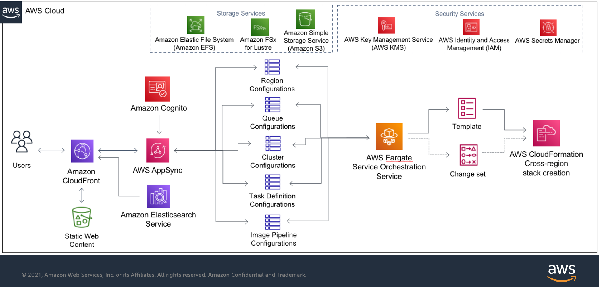

The main region architecture below contains the job scheduling and resource orchestration logic. Here you have the job queues, task definitions and compute clusters. YOu also have components not shown here for logging and monitoring.

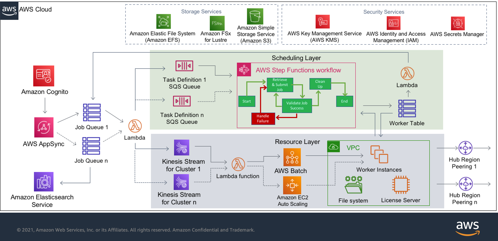

The hub region architecture below is created in any additional region you chose to use and extends the main region architecture above. 

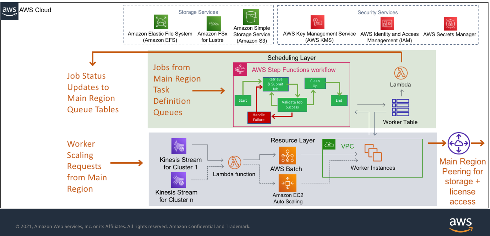

# EARLY RESULTS

Max Planck Institute is one of the customers that was part of our beta release. Their use of AWS-Cyclone-Solution is outlined below.

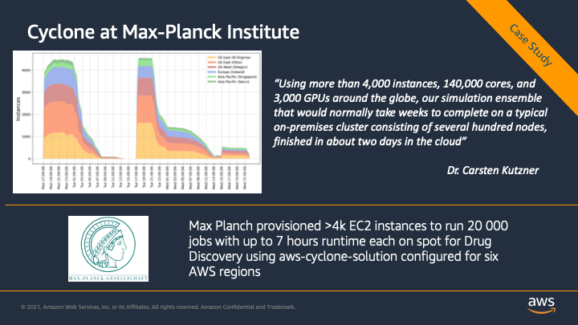

Here are some internal testing results early on in our development showing how the solution handles HTC grid type workloads with short running jobs. 

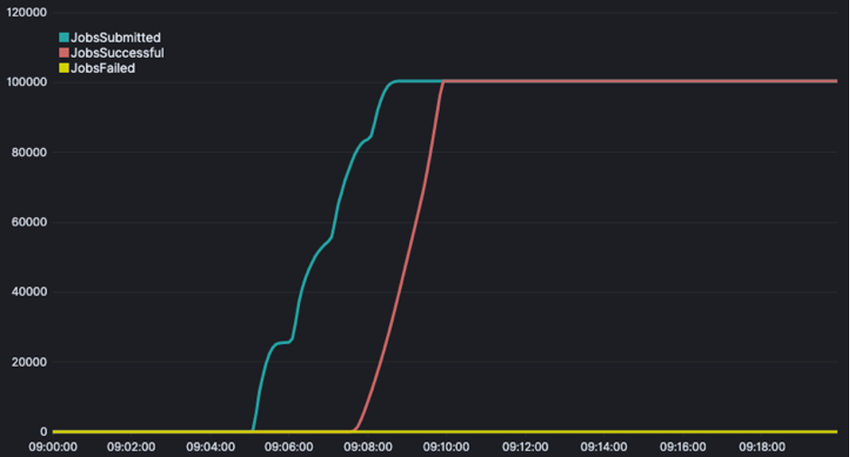

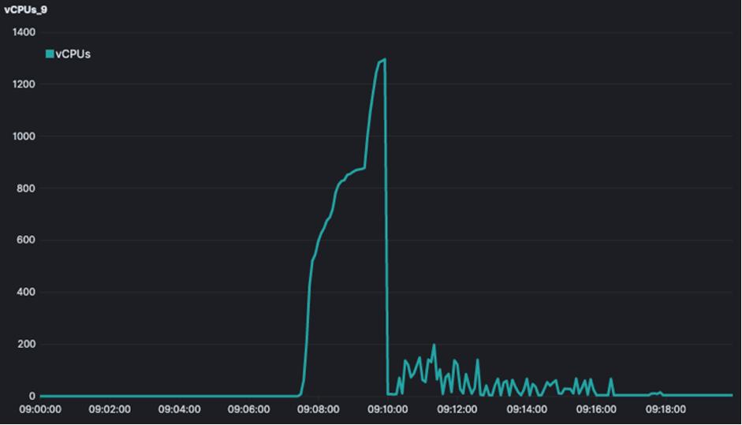

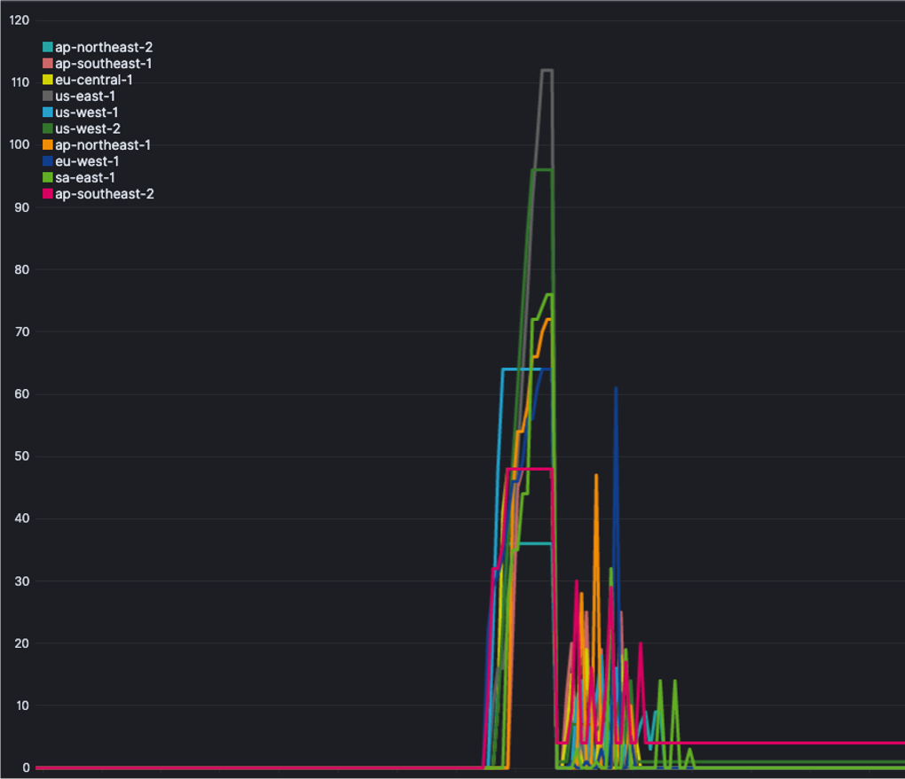